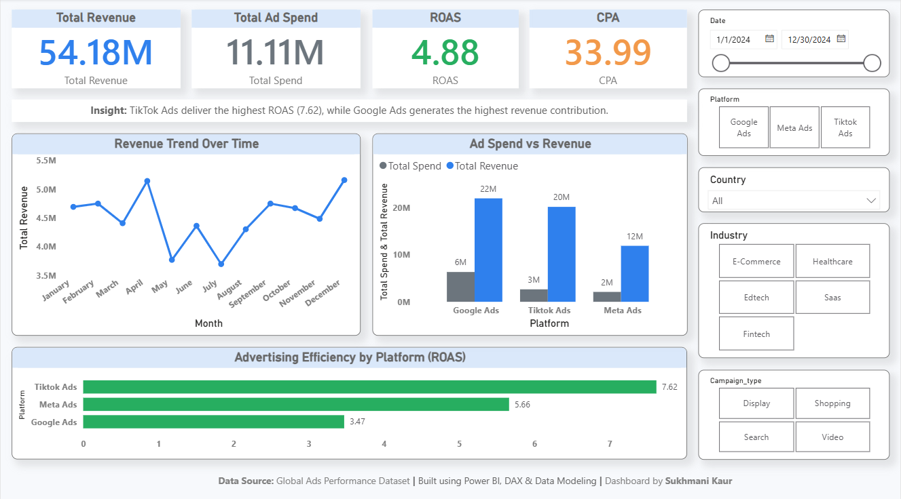
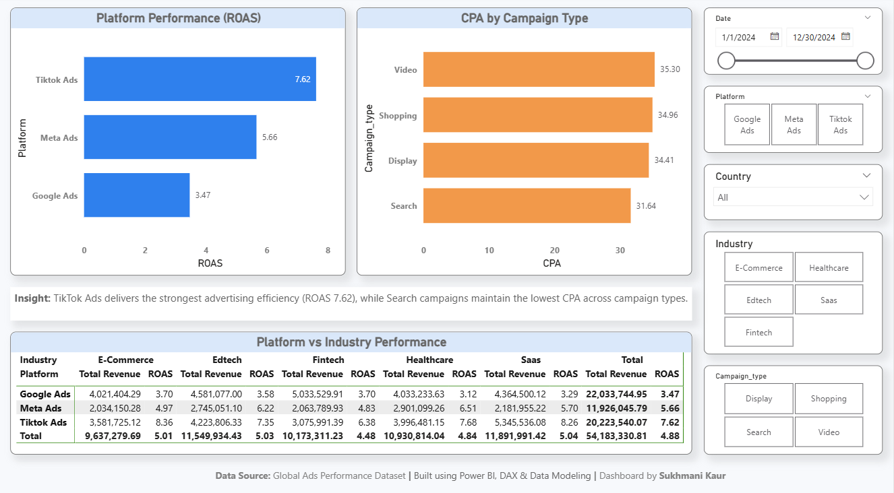
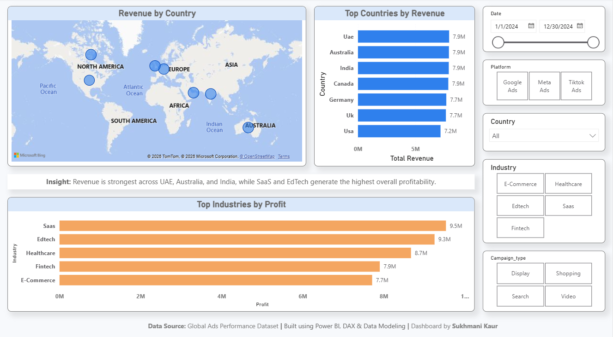

# Global Ads Performance Dashboard | Power BI

## Project Overview
This project analyzes global advertising performance across multiple platforms, industries, countries, and campaign types using Power BI.

The dashboard was designed to provide business insights into revenue generation, advertising efficiency, campaign performance and geographic trends.

The project includes:
- Data cleaning & transformation
- Star schema data modeling
- DAX measures & KPI tracking
- Interactive dashboards
- Business insights & storytelling

---

# Business Objective
The objective of this project was to help marketing stakeholders:
- Track advertising revenue and ad spend
- Analyze platform-level performance
- Measure advertising efficiency using ROAS and CPA
- Identify top-performing countries and industries
- Compare campaign effectiveness across different campaign types

---

# Tools & Technologies Used
- Power BI
- Power Query
- DAX
- Excel
- Data Modeling

---

# Key KPIs
- Total Revenue
- Total Ad Spend
- ROAS (Return on Ad Spend)
- CPA (Cost Per Acquisition)
- Profit

---

# Dashboard Pages

## 1. Executive Overview
Provides a high-level business summary including:
- Revenue trend over time
- Ad spend vs revenue comparison
- Platform efficiency analysis
- Executive KPI cards

### Key Insight
TikTok Ads delivered the highest ROAS, while Google Ads generated the highest revenue contribution.

---

## 2. Platform & Campaign Analysis
Analyzes:
- ROAS by platform
- CPA by campaign type
- Industry-wise platform performance

### Key Insight
TikTok Ads demonstrated the strongest advertising efficiency, while Search campaigns maintained the lowest CPA.

---

## 3. Geo & Industry Insights
Focuses on:
- Revenue distribution by country
- Top-performing countries
- Most profitable industries

### Key Insight
Revenue was strongest across UAE, Australia, and India, while SaaS and EdTech industries generated the highest profitability.

---

# Data Modeling
Implemented a star schema model by connecting a central fact table with multiple dimension tables.

### Fact Table
- Fact_Ads_Performance

### Dimension Tables
- Dim_Date
- Dim_Platform
- Dim_Country
- Dim_Industry
- Dim_Campaign

---

# DAX Measures Created
- Total Revenue
- Total Spend
- ROAS
- CPA
- Profit
- Revenue MoM %

---

# Key Skills Demonstrated
- Data cleaning & transformation
- Data modeling
- DAX calculations
- Dashboard design
- KPI reporting
- Interactive filtering
- Business storytelling
- Data visualization

---

# Dashboard Preview

## Executive Overview

## Platform & Campaign Analysis

## Geo & Industry Insights

---

# Conclusion
This project demonstrates how interactive dashboards can be used to monitor advertising performance, identify optimization opportunities, and support data-driven marketing decisions.
